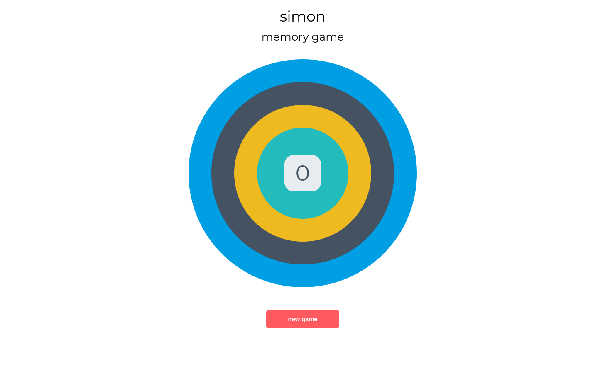

# Simon memory game

## About

Simon is a game that tests your short-term memory.The original device created a series of tones and lights and required a user to repeat the sequence. This HTML version of the game does not use any tones, just lights for simpicity sake.

Goal of this excercise is to practice TDD (Test Driven Development).

## Test framework
Test framework used is Jest https://jestjs.io/

### Install and setup
To create the package.json, first initialize with:

`npm init`

Only add "jest" as a test command and you can leave everything else as default 

To install Jest run:

`npm install jest --save-dev`

Note: since Jest 28 "jest-environment-jsdom" needs to be installed separatley, so run:

`npm install jest-environment-jsdom --save-dev`

Test file is located in scripts/tests

## Game screenshot

To run this locally, first clone the repo with

> git clone https://github.com/Azelliott/simon-jest-testing

You can then use any server to serve static files (Apache, Nginx, Node.js...),
or run the files directly from disk

To install the neccesary test modules do:

`npm install`

## Demo
[Simon memory game](https://azelliott.github.io/simon-jest-testing/)

